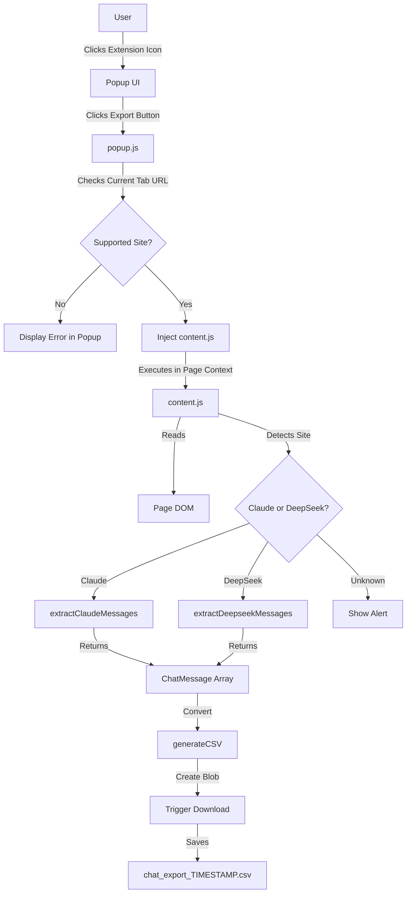

# Design Document: AI Chat Exporter Extension

## Overview

The AI Chat Exporter is a Firefox WebExtension that enables users to export publicly shared chats from Claude and DeepSeek into CSV files. The extension follows a simple three-component architecture: a popup UI for user interaction, a content script for DOM extraction and CSV generation, and a manifest configuration that ties everything together.

The design prioritizes simplicity, auditability, and privacy by keeping all processing client-side with no external dependencies or server communication.

**Target Platform**: This extension targets Firefox exclusively using Manifest V2. Chrome/Edge support is out of scope for this version. Mozilla has committed to supporting MV2 "for the foreseeable future" with long advance notice before any deprecation.

## Architecture

### High-Level Architecture



### Component Breakdown

1. **manifest.json**: Declares extension metadata, permissions, and entry points
2. **popup.html + popup.js**: Provides the user interface and orchestrates content script injection
3. **content.js**: Executes in the page context to extract messages and generate CSV

### Technology Stack

- **Manifest Version**: V2 (for maximum Firefox compatibility)
- **JavaScript**: ES6+ (const/let, arrow functions, template literals, destructuring)
- **APIs Used**:
  - `browser.tabs.query()` - Get active tab information
  - `browser.tabs.executeScript()` - Inject content script (MV2 API)
  - DOM APIs - Extract message content
  - Blob API - Create CSV file
  - URL.createObjectURL() - Generate download link

## Components and Interfaces

### 1. Manifest Configuration

**File**: `manifest.json`

**Purpose**: Declares extension capabilities, permissions, and resources

**Key Elements**:
```json
{
  "manifest_version": 2,
  "name": "AI Chat Exporter",
  "version": "1.0.0",
  "description": "Export Claude and DeepSeek public chats to CSV",
  "permissions": [
    "activeTab",
    "tabs"
  ],
  "browser_action": {
    "default_popup": "popup.html",
    "default_icon": {
      "48": "icon.png"
    }
  }
}
```

**Design Decisions**:
- Manifest V2 chosen for stable Firefox support
- **Least-privilege permissions**: Only `activeTab` and `tabs` are requested
  - `activeTab` grants temporary access to inject scripts when user clicks the extension icon
  - `tabs` enables querying the active tab URL
  - No host permissions needed since `activeTab` provides sufficient access
  - This minimizes permission scope and simplifies AMO review
- URL validation performed in popup.js before injection
- `browser_action` (MV2) instead of `action` (MV3)

### 2. Popup Interface

**Files**: `popup.html`, `popup.js`

**Purpose**: Provide user interface and validate target page before injection

**popup.html Structure**:
```html
<!DOCTYPE html>
<html>
<head>
  <meta charset="utf-8">
  <style>
    /* Minimal styling for clean UI */
  </style>
</head>
<body>
  <h3>AI Chat Exporter</h3>
  <div id="status"></div>
  <button id="exportBtn">Export this chat to CSV</button>
  <script src="popup.js"></script>
</body>
</html>
```

**popup.js Responsibilities**:
1. Query the active tab on popup load
2. Check if the current URL matches supported domains
3. Display appropriate status message
4. On button click:
   - Validate the current tab URL
   - Inject `content.js` into the active tab
   - Handle injection errors

**Domain Detection Logic**:
```javascript
const SUPPORTED_DOMAINS = {
  claude: ['claude.ai'],
  deepseek: ['chat.deepseek.com', 'deepseek.com']
};

function getSiteType(url) {
  const hostname = new URL(url).hostname;
  
  for (const [site, domains] of Object.entries(SUPPORTED_DOMAINS)) {
    // Use exact match or endsWith to avoid false positives like "evilclaude.ai.example.com"
    if (domains.some(domain => hostname === domain || hostname.endsWith(`.${domain}`))) {
      return site;
    }
  }
  
  return null;
}
```

**Security Note**: The domain matching uses exact match or `endsWith` with a leading dot to prevent matching malicious domains like `evilclaude.ai.example.com`.

**Error Handling**:
- If no active tab: Display "No active tab found"
- If unsupported domain: Display "This page is not supported. Please navigate to a Claude or DeepSeek chat."
- If injection fails: Display "Failed to inject export script into this page." and log technical error to console

**Injection Error Handling Example**:
```javascript
browser.tabs.executeScript(tabId, { file: 'content.js' })
  .catch(err => {
    console.error("Injection failed:", err);
    document.getElementById('status').textContent = 
      'Failed to inject export script into this page.';
  });
```

### 3. Content Script

**File**: `content.js`

**Purpose**: Extract chat messages from DOM, convert to CSV, and trigger download

**Execution Context**: Runs in the page's DOM context with access to all page elements

**Main Flow**:
```javascript
(function() {
  try {
    // 1. Detect current site
    const siteType = detectSite();
    
    // 2. Extract messages
    const messages = extractMessages(siteType);
    
    // 3. Validate extraction
    if (messages.length === 0) {
      alert("No messages found on this page.");
      return;
    }
    
    // 4. Generate CSV
    const csv = generateCSV(messages);
    
    // 5. Trigger download
    downloadCSV(csv);
    
  } catch (error) {
    console.error("Export failed:", error);
    alert("Failed to extract chat. Please check that this is a Claude or DeepSeek public chat page.");
  }
})();
```

## Data Models

### ChatMessage Interface

```typescript
interface ChatMessage {
  index: number;        // Sequential message number (0-based)
  role: string;         // "user" | "assistant" | "system" | "other"
  timestamp: string;    // ISO format or empty string if unavailable
  content: string;      // Plain text content with preserved structure
  source: string;       // "claude" | "deepseek"
}
```

**Field Extraction Rules**:
- **index**: Assigned sequentially during extraction (0, 1, 2, ...)
- **role**: Determined by DOM attributes (class names, aria-labels, data attributes)
- **timestamp**: Extracted from time elements or date strings; empty string if not found
- **content**: Text content with:
  - HTML tags stripped
  - Line breaks preserved between block elements
  - Code blocks preserved with formatting
  - Multiple whitespace collapsed to single space
- **source**: Determined by current hostname

### CSV Format

**Columns**: `index,role,timestamp,content,source`

**Encoding**: UTF-8 with BOM for Excel compatibility

**Escaping Rules** (RFC 4180):
- Wrap field in quotes if it contains: comma, newline, or double quote
- Escape double quotes by doubling them (`"` becomes `""`)

**Example**:
```csv
index,role,timestamp,content,source
0,user,2024-11-17T10:30:00Z,"Hello, how are you?",claude
1,assistant,2024-11-17T10:30:05Z,"I'm doing well, thank you! How can I help you today?",claude
2,user,2024-11-17T10:31:00Z,"Can you explain ""recursion""?",claude
```

## Message Extraction Strategy

### Selector Architecture

**Design Principle**: Centralize selectors in constants for easy maintenance

```javascript
// Claude selectors
const CLAUDE_SELECTORS = {
  messageContainer: '[data-testid="conversation-turn"]',  // Placeholder
  userMessage: '.user-message',                           // Placeholder
  assistantMessage: '.assistant-message',                 // Placeholder
  timestamp: 'time',                                      // Placeholder
  contentBlock: '.message-content'                        // Placeholder
};

// DeepSeek selectors
const DEEPSEEK_SELECTORS = {
  messageContainer: '.chat-message',                      // Placeholder
  userMessage: '.message-user',                           // Placeholder
  assistantMessage: '.message-assistant',                 // Placeholder
  timestamp: '.message-time',                             // Placeholder
  contentBlock: '.message-text'                           // Placeholder
};
```

**Note**: These are placeholder selectors. Actual selectors must be determined by inspecting the live DOM of Claude and DeepSeek chat pages.

### Extraction Algorithm

#### Claude Extraction

```javascript
function extractClaudeMessages(document) {
  const messages = [];
  const messageNodes = document.querySelectorAll(CLAUDE_SELECTORS.messageContainer);
  
  messageNodes.forEach((node, index) => {
    try {
      // Determine role - prioritize outermost container attributes to avoid
      // misclassifying nested quoted messages
      let role = 'other';
      if (node.matches(CLAUDE_SELECTORS.userMessage)) {
        role = 'user';
      } else if (node.matches(CLAUDE_SELECTORS.assistantMessage)) {
        role = 'assistant';
      } else if (node.querySelector(CLAUDE_SELECTORS.userMessage)) {
        role = 'user';
      } else if (node.querySelector(CLAUDE_SELECTORS.assistantMessage)) {
        role = 'assistant';
      }
      
      // Extract timestamp
      const timeElement = node.querySelector(CLAUDE_SELECTORS.timestamp);
      const timestamp = timeElement ? 
        (timeElement.getAttribute('datetime') || timeElement.textContent.trim()) : '';
      
      // Extract content
      const contentElement = node.querySelector(CLAUDE_SELECTORS.contentBlock) || node;
      const content = extractTextContent(contentElement);
      
      messages.push({
        index,
        role,
        timestamp,
        content,
        source: 'claude'
      });
    } catch (error) {
      console.warn(`Failed to parse message ${index}:`, error);
      // Continue with next message - best-effort extraction
    }
  });
  
  return messages;
}
```

**Extraction Strategy**: The extractor attempts to extract all visible messages using a best-effort approach. If some messages cannot be parsed due to unexpected DOM structure, they are skipped with a console warning, but the export continues. The export only fails if zero messages were successfully extracted.

#### DeepSeek Extraction

```javascript
function extractDeepseekMessages(document) {
  const messages = [];
  const messageNodes = document.querySelectorAll(DEEPSEEK_SELECTORS.messageContainer);
  
  messageNodes.forEach((node, index) => {
    try {
      // Determine role
      let role = 'other';
      if (node.classList.contains('message-user')) {
        role = 'user';
      } else if (node.classList.contains('message-assistant')) {
        role = 'assistant';
      }
      
      // Extract timestamp
      const timeElement = node.querySelector(DEEPSEEK_SELECTORS.timestamp);
      const timestamp = timeElement ? timeElement.textContent.trim() : '';
      
      // Extract content
      const contentElement = node.querySelector(DEEPSEEK_SELECTORS.contentBlock) || node;
      const content = extractTextContent(contentElement);
      
      messages.push({
        index,
        role,
        timestamp,
        content,
        source: 'deepseek'
      });
    } catch (error) {
      console.warn(`Failed to parse message ${index}:`, error);
      // Continue with next message
    }
  });
  
  return messages;
}
```

### Text Content Extraction

**Purpose**: Convert HTML content to readable plain text suitable for CSV export

**Design Trade-offs**:
- Prioritizes readability over perfect structure preservation
- Collapses empty lines to reduce CSV bloat
- Treats true block elements (p, div, pre, li, br) as line break boundaries
- Does not preserve inline code formatting (acceptable for CSV context)

```javascript
function extractTextContent(element) {
  // Clone to avoid modifying original DOM
  const clone = element.cloneNode(true);
  
  // Add line breaks after true block elements only
  // Note: We handle BR separately and don't treat inline code as block
  const blockElements = clone.querySelectorAll('p, div, pre, li');
  blockElements.forEach(el => {
    el.insertAdjacentText('afterend', '\n');
  });
  
  // Handle BR elements specifically
  const brElements = clone.querySelectorAll('br');
  brElements.forEach(br => {
    br.replaceWith('\n');
  });
  
  // Get text content
  let text = clone.textContent || '';
  
  // Normalize whitespace and collapse empty lines
  // This is intentional: we prioritize CSV readability over preserving
  // exact spacing from the original HTML
  text = text.split('\n')
    .map(line => line.trim())
    .filter(line => line.length > 0)
    .join('\n');
  
  return text;
}
```

**Behavior Notes**:
- Empty lines are intentionally collapsed (not preserved)
- Multiple consecutive spaces are normalized to single spaces
- Line breaks between paragraphs and list items are preserved
- Code blocks are treated as single blocks with internal line breaks preserved

## CSV Generation

### CSV Builder Function

```javascript
function generateCSV(messages) {
  // Header row
  const headers = ['index', 'role', 'timestamp', 'content', 'source'];
  const rows = [headers];
  
  // Data rows
  messages.forEach(msg => {
    rows.push([
      msg.index.toString(),
      escapeCSVField(msg.role),
      escapeCSVField(msg.timestamp),
      escapeCSVField(msg.content),
      escapeCSVField(msg.source)
    ]);
  });
  
  // Join rows with newlines
  return rows.map(row => row.join(',')).join('\n');
}

function escapeCSVField(field) {
  // Convert to string
  const str = String(field);
  
  // Check if escaping is needed
  if (str.includes(',') || str.includes('"') || str.includes('\n')) {
    // Escape quotes by doubling them
    const escaped = str.replace(/"/g, '""');
    // Wrap in quotes
    return `"${escaped}"`;
  }
  
  return str;
}
```

**Performance Consideration**: For large chats (up to 1000 messages), array concatenation is efficient enough. If performance becomes an issue, consider using a string builder pattern.

## File Download Mechanism

### Download Trigger

```javascript
function downloadCSV(csvContent) {
  // Generate timestamp for filename
  const now = new Date();
  const timestamp = now.toISOString()
    .replace(/:/g, '-')
    .replace(/\..+/, '')
    .replace('T', '_');
  // Example result: "2024-11-17_10-30-00"
  const filename = `chat_export_${timestamp}.csv`;
  
  // Create blob with UTF-8 BOM for Excel compatibility
  const BOM = '\uFEFF';
  const blob = new Blob([BOM + csvContent], { 
    type: 'text/csv;charset=utf-8;' 
  });
  
  // Create download link
  const url = URL.createObjectURL(blob);
  const link = document.createElement('a');
  link.href = url;
  link.download = filename;
  link.style.display = 'none';
  
  // Trigger download
  document.body.appendChild(link);
  link.click();
  
  // Cleanup
  setTimeout(() => {
    document.body.removeChild(link);
    URL.revokeObjectURL(url);
  }, 100);
}
```

**Design Decisions**:
- UTF-8 BOM added for Excel compatibility
- Timestamp format: Filesystem-safe ISO-like format (e.g., `2024-11-17_10-30-00`)
- Cleanup delayed by 100ms to ensure download starts
- Link hidden to avoid visual flash
- **DOM modification**: The extension temporarily injects a hidden `<a>` element for download, which is removed immediately after. No other page modifications occur.

## Error Handling

### Error Categories and Responses

| Error Type | Detection | User Message | Console Log |
|------------|-----------|--------------|-------------|
| Unsupported site | URL check in popup | "This page is not supported..." | None |
| No messages found | Empty array after extraction | "No messages found on this page." | Warning with selector info |
| Extraction exception | try-catch in content script | "Failed to extract chat..." | Full error stack trace |
| Injection failure | executeScript error | "Failed to inject export script..." | Error in popup console |
| Partial extraction | Some messages fail to parse | None (export continues) | Warning for each failed message |

### Graceful Degradation

**Partial Extraction Failure**:
- If some messages fail to parse, log warning and continue
- Only fail completely if zero messages extracted
- This aligns with the best-effort extraction strategy: we attempt to extract all messages, but don't abort the entire export if a subset fails

**Missing Timestamps**:
- Use empty string instead of failing
- CSV will contain empty timestamp field for those messages

**Unknown Role**:
- Default to "other" instead of failing
- Allows extraction to continue even with unexpected DOM structure

**DOM Change Detection**:
- If selectors fail and no messages are found, this indicates a regression
- Selectors should be updated in the centralized constants
- Users should be advised to report the issue if extraction suddenly stops working

## Testing Strategy

### Manual Testing Checklist

**Functional Tests**:
1. ✓ Install extension in Firefox
2. ✓ Navigate to Claude public chat
3. ✓ Click extension icon → popup appears
4. ✓ Click "Export this chat to CSV" → download triggers
5. ✓ Open CSV in spreadsheet → data is correct
6. ✓ Repeat for DeepSeek public chat
7. ✓ Test on unsupported site → error message shown
8. ✓ Test on page with no messages → alert shown
9. ✓ Test with chat containing special characters (quotes, commas, newlines)
10. ✓ Test with large chat (100+ messages) → no UI freeze

**Edge Cases**:
- Empty chat page
- Chat with only user messages
- Chat with only assistant messages
- Messages with code blocks
- Messages with markdown formatting
- Messages with emojis and Unicode
- Very long messages (10,000+ characters)
- Rapid successive exports

**Browser Compatibility**:
- Firefox ESR (latest)
- Firefox stable (latest)
- Firefox Developer Edition (optional)

### Validation Tests

**CSV Validation**:
1. Open in Excel → no parsing errors
2. Open in Google Sheets → no parsing errors
3. Parse with Python csv module → no errors
4. Check UTF-8 encoding → no mojibake

**Permission Validation**:
1. Check manifest permissions → only necessary ones listed
2. Test on non-whitelisted domain → injection fails gracefully
3. Verify no network requests in browser DevTools

### Debugging Approach

**Console Logging Strategy**:
- Log extraction start with site type
- Log message count after extraction
- Log CSV generation completion
- Log download trigger
- Log all errors with full context

**Common Issues and Solutions**:
| Issue | Likely Cause | Solution |
|-------|--------------|----------|
| No messages extracted | Selectors outdated | Inspect DOM, update selectors |
| CSV parsing errors | Escaping bug | Check escapeCSVField logic |
| Download doesn't trigger | Blob/URL API issue | Check browser console |
| Extension icon not clickable | Permissions issue | Check manifest permissions |

## Security Considerations

### Threat Model

**Out of Scope** (by design):
- Server-side attacks (no server)
- Network interception (no network requests)
- Authentication bypass (no auth handling)

**In Scope**:
- Malicious page content injection
- XSS via extracted content
- Privacy leaks via extension

### Mitigation Strategies

**Content Security**:
- All extracted content treated as untrusted
- No `eval()` or `innerHTML` usage
- CSV generation uses pure string operations
- No dynamic script loading

**Privacy Protection**:
- No data sent to external servers
- No persistent storage of chat content
- No analytics or telemetry
- Minimal permissions (activeTab + tabs only) prevent access to other sites

**Extension Isolation**:
- Content script runs in isolated world (standard WebExtension behavior)
- No shared state between tabs
- Each export is independent

**Page Modification**:
- The extension does not inject any UI elements or modify the page beyond creating a temporary hidden `<a>` element for download
- The download link is removed immediately after triggering the download
- No persistent changes to the page DOM

## Performance Optimization

### Expected Performance

**Target**: Handle 500-1000 messages without UI freeze

**Benchmarks** (estimated):
- DOM extraction: ~50ms for 100 messages
- CSV generation: ~20ms for 100 messages
- Blob creation: ~10ms
- Total: <100ms for typical chat (100 messages)

**Performance Notes**:
- Current design is fully synchronous
- For chats up to ~500 messages, this should be imperceptible
- For larger chats (500-1000 messages), there may be a brief pause
- If performance issues arise with very large chats, we can chunk work using `requestIdleCallback`
- The 1000-message target is aspirational; testing will determine actual limits

### Optimization Techniques

**Efficient DOM Traversal**:
- Use `querySelectorAll` once, iterate results
- Avoid repeated DOM queries in loops
- Clone nodes only when necessary

**String Building**:
- Use array join instead of string concatenation
- Pre-allocate array size if known

**Async Considerations**:
- Current design is synchronous (fast enough for target)
- If needed, could chunk processing with `requestIdleCallback`

**Memory Management**:
- Clean up blob URLs after download
- Remove temporary DOM elements
- No global state retention

## Future Enhancements

**Potential Features** (not in current scope):
1. Support for additional platforms (ChatGPT, Gemini)
2. Export format options (JSON, Markdown)
3. Filtering options (date range, role)
4. Batch export of multiple chats
5. Custom filename templates
6. Progress indicator for large chats
7. Export preview before download
8. Internationalization (i18n) for UI text

**Maintenance Considerations**:
- Selectors will need periodic updates as sites change
- Consider adding selector validation/testing
- Monitor browser API changes (MV2 → MV3 migration)
- Track Firefox WebExtension API evolution

## Deployment

### Build Process

**No build step required** - pure HTML/CSS/JS

**File Structure**:
```
ai-chat-exporter/
├── manifest.json
├── popup.html
├── popup.js
├── content.js
├── icon.png (48x48)
└── README.md
```

### Installation (Development)

1. Open Firefox
2. Navigate to `about:debugging#/runtime/this-firefox`
3. Click "Load Temporary Add-on..."
4. Select `manifest.json` from extension directory
5. Extension loads and appears in toolbar

### Distribution

**Firefox Add-ons (AMO)**:
1. Create developer account
2. Submit extension for review
3. Pass automated and manual review
4. Extension published to store

**Self-Distribution**:
1. Package as `.xpi` file
2. Sign with Mozilla (required for Firefox)
3. Distribute via website or GitHub releases

## Conclusion

This design provides a simple, secure, and maintainable solution for exporting AI chat conversations. The architecture prioritizes user privacy by keeping all processing client-side, uses standard browser APIs for maximum compatibility, and organizes code for easy auditing and maintenance.

The modular extraction strategy allows for easy adaptation to DOM changes, while the centralized configuration makes updates straightforward. Error handling ensures users receive clear feedback, and the CSV format provides broad compatibility with data analysis tools.
